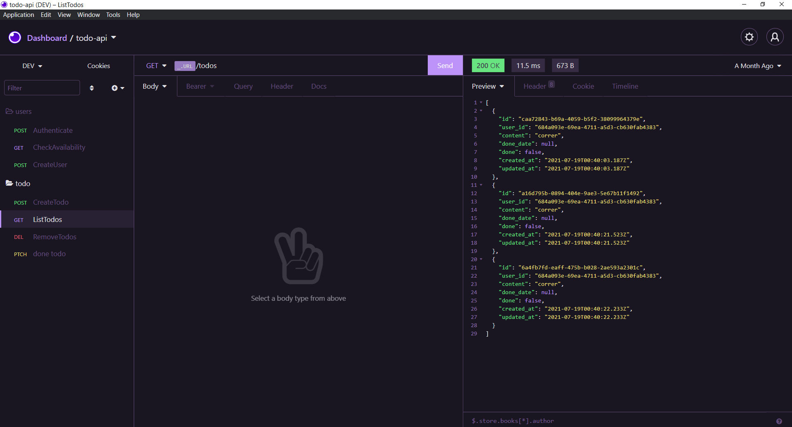
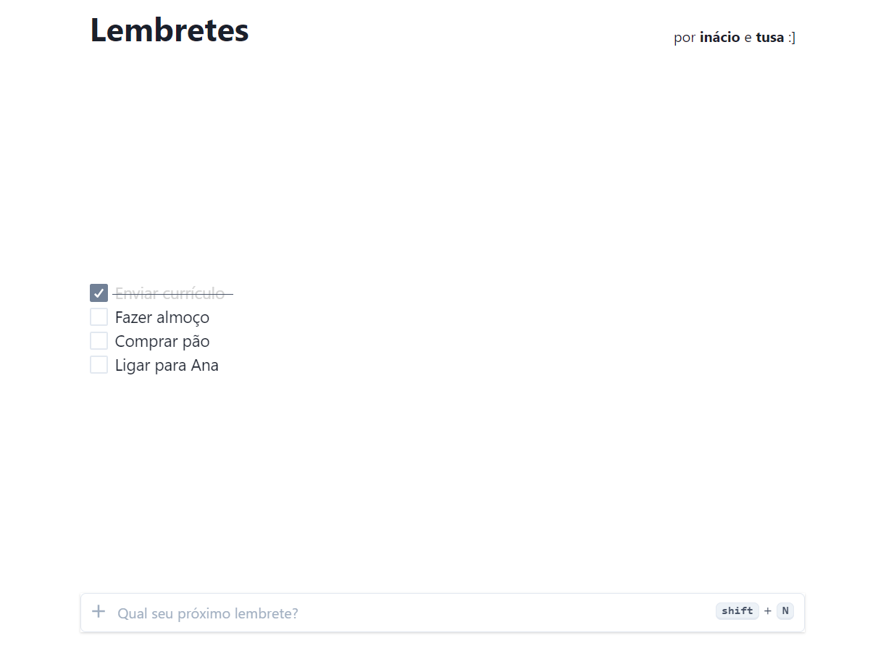

<h1 align="center">TODO-APP</h1>

  
  

## ✨ Tecnologias

O backend deste projeto foi desenvolvido com as seguintes tecnologias:

- [TypeScript](https://www.typescriptlang.org/)
- [TypeORM](https://typeorm.io/#/)
- [Express](https://expressjs.com/pt-br/)

## 💻 Projeto

O Todo-app é uma aplicação web para organização de tarefas (todo-list), no qual desenvolvi a api responsável pelo backend. O projeto pode ser acessado aqui:
- [TODO-APP](https://todo-app-inacio-tusa.vercel.app/)

## 🚀 Como executar

- Clone o repositório
- Instale as dependências com npm ou yarn
- Inicie o servidor com o script `dev`

A aplicação pode ser acessada em [`localhost:3333`](http://localhost:3333).
